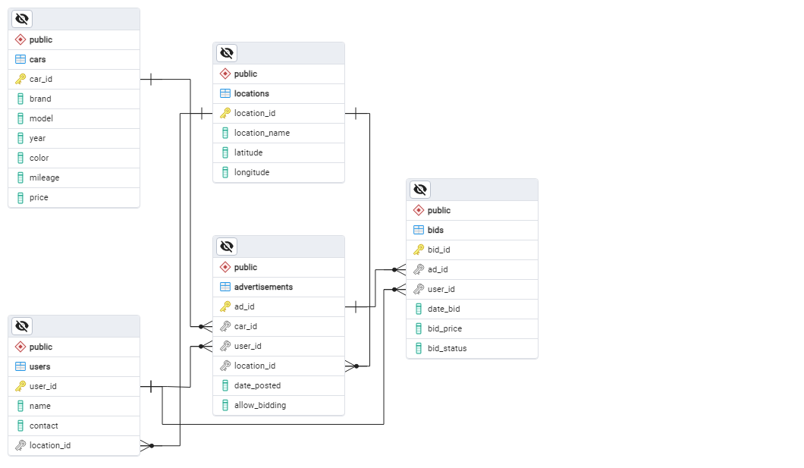

# Online Car Sales Platform Database
This project is focused on designing and implementing a relational database for an online used car sales platform. The full report detailing the project's objectives, methods, and outcomes is available in [my Medium article](https://medium.com/@farahananda/data-on-wheels-how-i-built-a-relational-database-for-car-enthusiasts-7351712929ea).

## Mission Statement
- Design an efficient relational database to manage car sales and bids.
- Enable users to easily get data for decision-making.
- Facilitate seamless integration with front-end applications.

## ERD

## Database Making
The SQL Data Definition Language (DDL) scripts used to create the database schema can be found in the [`DDL.sql`](DDL.sql) file.

## Making the Datasets
We combined data from [Kaggle](https://www.kaggle.com/datasets/arnavsmayan/vehicle-manufacturing-dataset), [GitHub](https://github.com/plotly/datasets/blob/master/us-cities-top-1k.csv), and dummy datasets to create the necessary datasets for this project. The code used to generate these datasets is available in the [`generate_datasets.py`](generate_datasets.py) file.

## Inputting the Data
Some of the data may vary due to random generation processes. The datasets used for this project are located in the [`datasets`](datasets) folder. To insert data into the database, you can use the SQL syntax provided in [`input_data.sql`](input_data.sql). Make sure to replace `/path/to/` with the actual path to the files on your system.

## Transactional Queries
- [Search for cars that were released in 2019 or later](queries/Transactional_1.sql)
- [Adding a bid to the dataset](queries/Transactional_2.sql)
- [Check all the cars sold by one seller](queries/Transactional_3.sql)
- [Search for the cheapest cars using a keyword](queries/Transactional_4.sql)
- [Search for the nearest cars for sale](queries/Transactional_5.sql)

## Analytical Queries
- [What are the most popular cars based on the number of bids?](queries/Analytical_1.sql)
- [How does a car's price compare to the average car prices in the city where it is sold?](queries/Analytical_2.sql)
- [How does a user's first bid compare to their next bid?](queries/Analytical_3.sql)
- [How does the difference between the model average price and average bid looks like?](queries/Analytical_4.sql)
- [What is the average bid price for each car over the past 6 months?](queries/Analytical_5.sql)
